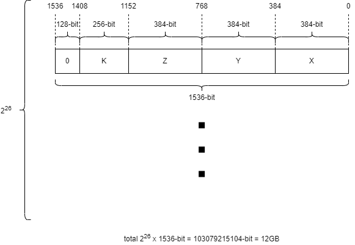

# BSTMSM-OS
Open source the verilog and host code of BSTMSM

# Environment
v++ 2022.1

g++ 11.4.0

boost 1.83.0

xrt_202210.2.13.466

xilinx-u250-gen3x16-xdma-4.1-202210-1

# How to Build
Run "make build" in folder SinglePADD or DoublePADD to build host and bitstream of Single PADD BSTMSM or Double PADD BSTMSM

# Test Data Format

To test BSTMSM, parameters.dat with such format needs to be generated, requires a total of 12GB storage space.